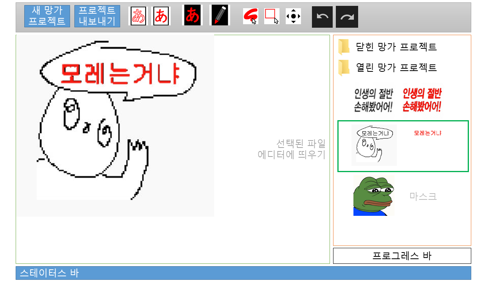
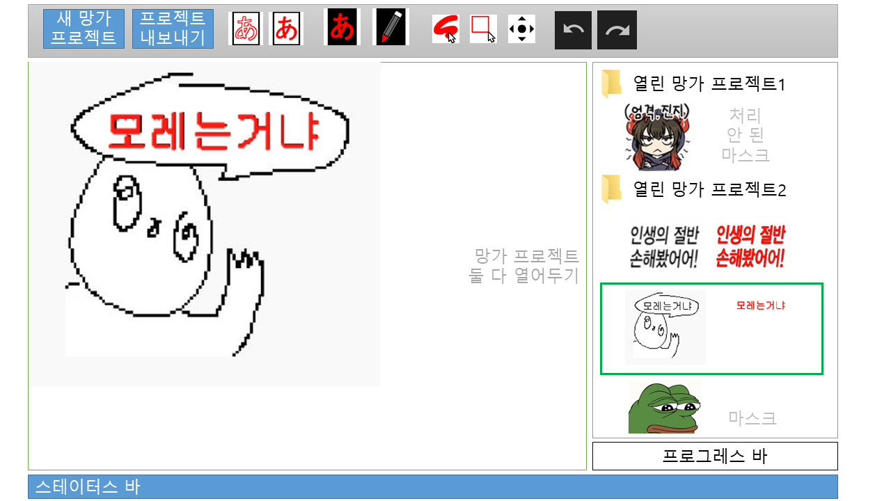
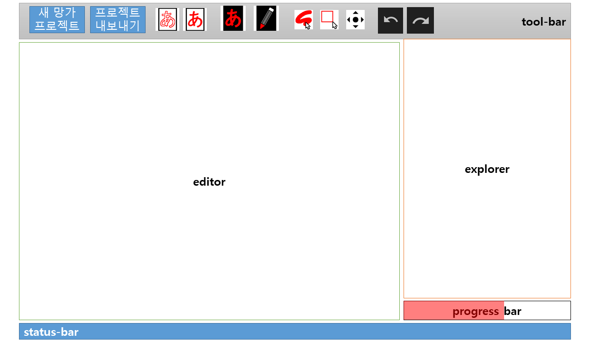
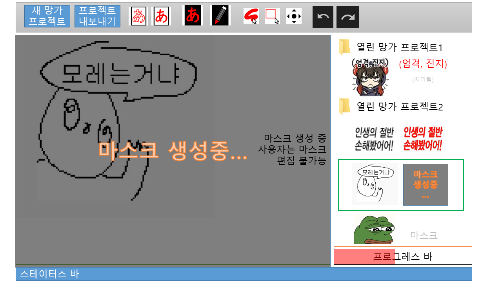
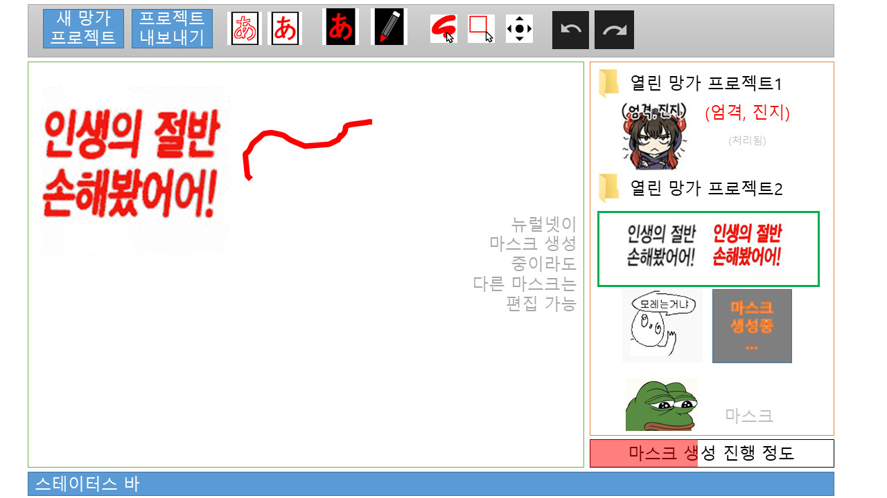
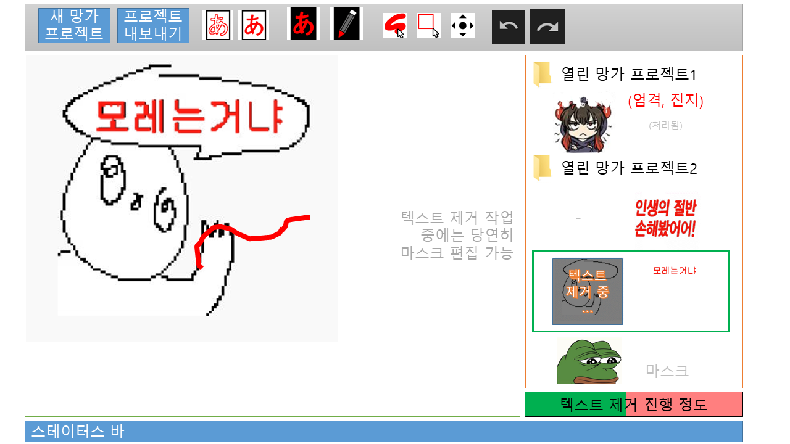
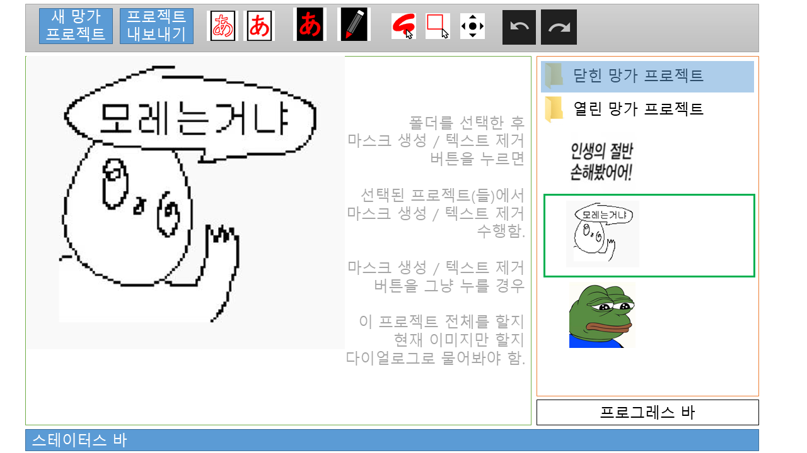
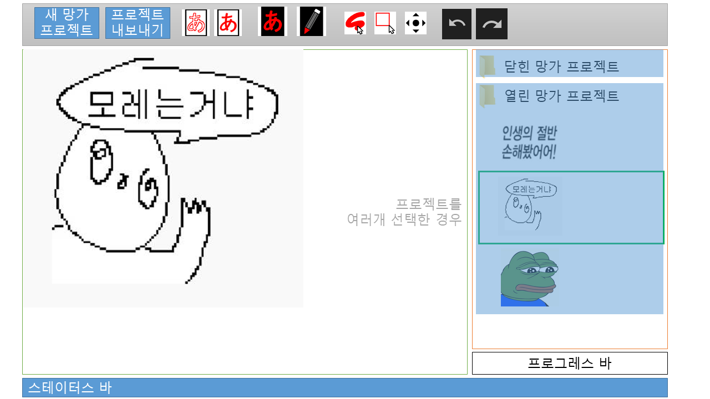

# 생각해본 기능들
나중에 스펙에 자세히 명확하게 구체적으로 적어드리겠음

### 익스플로러는 다음과 같이 탐색기처럼 구성

- 탐색기 안에 이미지와 마스크를 나열
- 열고 닫을 수 있음
- 깊이는 일단 1 단계만 가능해도 됨

### 툴의 경우 일단 v0 것들처럼 구현

- snet(마스크 생성) / cnet(텍스트 제거)
- draw / erase 모드
- 펜 / 사각형 툴
- 마우스 휠 버튼을 누른채로 드래그하여 자유로운 이미지 스크롤
- 펜 툴 크기 키우기 / 줄이기
- 마스크 보이기 / 안 보이기

### v0와 다른 것
- 확대 / 축소
- undo / redo
- 마스크 알파 적용
- export 기능
- 프로그레스 바(마스크 생성 / 텍스트 제거 작업용)

### 프로그레스 바와 딥러닝 모델 inference
식질머신에서 딥러닝 모델은 2개가 사용됨 
- snet: 이미지 -> 마스크 
- cnet: 이미지,마스크 -> 텍스트 지워진 이미지

진행되고 있지 않을 때는 프로그레스 바에 아무것도 없음

마스크가 생성되고 있을 때는 마스크를 편집할 수 없음

현재 생성 중인 마스크가 아니라면 편집 가능

텍스트 제거(cnet)의 경우 마스크를 편집할 수 있음

- 마스크 생성 / 텍스트 제거 중일 때는, 명령을 위한 버튼은 비활성 상태로 표시해주는게 좋을 것 

### 몇몇 사항들
"현재 열고 있는 망가 프로젝트" 라는 상태는 없음(v0에서는 무조건 하나의 망가 프로젝트를 열어서 작업해야 했음)

(마스크 생성 / 텍스트 제거)는 한번에 **여러 이미지**에 적용 가능한데 \
(탐색기처럼) 폴더를 선택하거나, 이미지 여럿을 선택하면 \
여러개의 이미지에 적용 가능

주의: 배치 명령 실행을 위한 선택과, 현제 에디터에 띄우기 위한 선택을 구분해야 함. \
일단 위 이미지에서 
- 초록색 사각형은 에디터에 표시되는 것
- 파란색 음영 선택은 배치 명령 실행을 위해 선택된 것

마스크가 변경되었는지, 이미지가 처리되었는지 확인하기 위해, dirty 플래그 같은 것이 필요할 것  
  (마스크가 변경되지 않았으면 딥러닝 모델을 다시 돌릴 필요가 없음)

