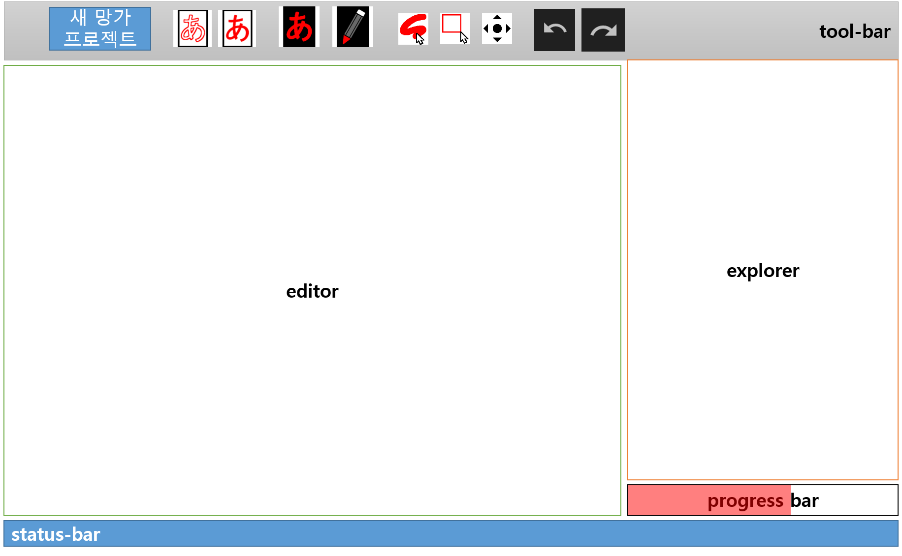
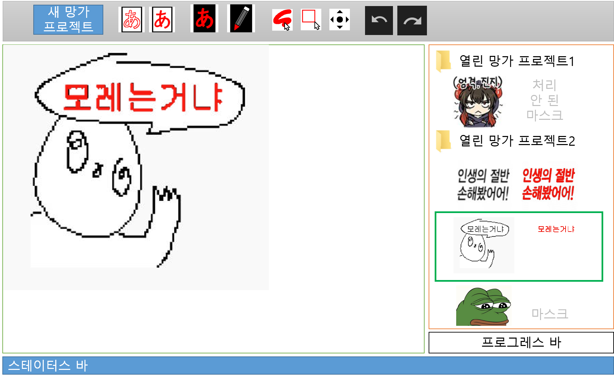

## SZMC v1 spec

스펙은 목표(What)에 해당하는 (사용자의) [작업-과정](#작업-과정), 해결방법(How)에 해당하는 [앱](#앱)으로 구성됩니다. 

지금 당장 필요한 것은 아니지만 미래에 추가하면 좋겠다 싶은 기능, 혹은 중요도가 낮은 기능은 작은 글자로 표시합니다. 

# 작업-과정

[`create-manga-project`](#create-manga-project) => [`edit-mask`](#edit-mask) => [`remove-text`](#edit-mask) => [`export-manga-project`](#export-manga-project)

## create-manga-project
사용자는 이미지 파일(들)을 불러와서 manga-project를 생성할 수 있습니다. \
##### manga-project
- 망가 프로젝트: manga-project는 [manga-image](#manga-image)들의 리스트와 각 이미지에 대응하는 [manga-mask](#manga-mask)들로 이루어집니다.
- 생성: manga-project가 생성될 때 각 manga-image에 대응하는 manga-mask는 투명한 비어있는 이미지로 생성됩니다.
- 순서 유지: manga-project의 manga-image와 manga-mask는 순서가 유지되어야 합니다.
- 영속성: manga-project는 사용자의 디스크에 영속적으로 저장되어야 합니다.
- Retrieval: manga-project는 브라우저를 끈 뒤 다시 식질머신을 켰을 때 로드하여 작업을 이어갈 수 있어야 합니다.
##### manga-image
- 원본: manga-image는 원본 이미지입니다. png, jpg를 기본적으로 지원합니다. (그 외에는 일단 무시)
- 버전관리1: manga-image의 변경 사항은 모두 저장되어야 합니다. (v1에서 manga-image를 변화시키는 방법은 딥러닝을 이용하는 방법 뿐입니다.)
- 버전관리2: 사용자는 manga-image의 특정 버전을 가져와서 편집할 수 있습니다.
- 영속적버전관리: manga-image의 버전들을 영속적으로 저장할 수 있습니다
##### manga-mask
- 지울 영역 표시: manga-mask는 manga-image에서 [텍스트를 지워야하는 영역(rm-area)](#rm-area)을 픽셀 단위로 표시합니다. 최초에는 투명한 빈 이미지입니다.
- 마스크: manga-mask는 투명한 빈 이미지 위에 빨간색(#FF0000)으로 [rm-area](#rm-area)를 표시합니다.
- 버전관리1: manga-mask의 변경 사항은 모두 저장되어야 합니다.
- 버전관리2: 사용자는 manga-manga의 특정 버전을 가져와서 편집할 수 있습니다. (undo/redo)
-  영속적버전관리: manga-mask의 버전들을 영속적으로 저장할 수 있습니다(구현하지 않을 수도 있음) 
##### rm-area
- manga-mask에서 텍스트를 지워야하는 영역입니다. 

## edit-mask
사용자는 [manga-project](#manga-project)의 [manga-mask](#manga-mask)를 [editor](#editor)에 로드하여 편집할 수 있습니다.
- draw: 사용자는 manga-mask에 [pen-tool](#pen-tool), [rect-tool](#rect-tool)로 [rm-area](#rm-area)를 그릴(넓힐) 수 있습니다. (더 많은 툴 추가 가능)
- erase: 사용자는 manga-mask에 [pen-tool](#pen-tool), [rect-tool](#rect-tool)로 [rm-area](#rm-area)를 지울(줄일) 수 있습니다. (더 많은 툴 추가 가능)
- auto-gen: 사용자는 manga-mask를 자동으로 생성할 수 있습니다.
- auto-gen-many: 사용자는 선택한 프로젝트 혹은 이미지들의 manga-mask를 자동으로 생성할 수 있습니다.

## remove-text
- rm-txt: 사용자는 [rm-area](#rm-area)가 표시하는 [manga-image](#manga-image) 영역을 자연스럽게 지울 수 있습니다.
- rm-txt-many: 사용자는 선택한 프로젝트 혹은 이미지들의 rm-area를 자연스럽게 지울 수 있습니다.

## export-manga-project
사용자는 [manga-project](#manga-project)를 다운로드 받을 수 있습니다.

**---------------------------------(WIP)---------------------------------------**
# 앱 
# GUI 

[작업-과정](#작업-과정) 을 구현하기 위한 GUI입니다.
## tool-bar
- new manga project 버튼: 열기 버튼을 눌러 대화 상자를 열고, 작업할 이미지 파일(들) 혹은 폴더를 선택하고, manga-project의 이름을 입력받아 프로젝트를 생성할 수 있습니다. 생성된 만화 프로젝트는 explorer에서 
## explorer
만화 프로젝트는 폴더로, 각 이미지는 이미지 썸네일로 표시합니다.
drag&drop 기능: 인터넷이나 로컬에서 이미지를 드래그앤드롭으로 추가 가능
## editor
- 표시: editor는 현재 선택된 manga-mask와 
- 투명종이: 사용자는 manga-image 위에 manga-mask를 겹쳐 보면서 편집할 수 있습니다.
- 스크롤: 사용자는 이미지와 마스크를 스크롤 가능..

##### pen-tool
- pen: 사용자는 원형의 영역을 클릭하여 마스크에 추가할 수 있습니다. (그림판, 김프, 포토샵 참조.)
##### rect-tool
- rect: 사용자는 사각형의 영역을 드래그하여 마스크에 추가할 수 있습니다. (식질머신 v0 참조 https://youtu.be/-hJ_U0xz860?t=33)
##### opacity-control
- 투명도조절: 사용자는 manga-mask의 투명도를 조절할 수 있습니다. 
- 마스크토글1: 사용자는 버튼을 눌러서 (현재 투명도) <-> (완전 투명함)을 빠르게 전환할 수 있습니다
- 마스크토글2: (완전히 투명함) 상태에서 [draw](#draw)나 [erase](#erase)작업을 할 경우 다시 (현재 투명도)로 돌아옵니다

## status-bar

만화 프로젝트에서  
**---------------------------------(WIP)---------------------------------------**
